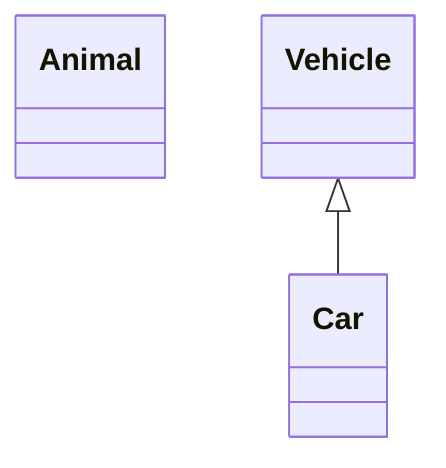
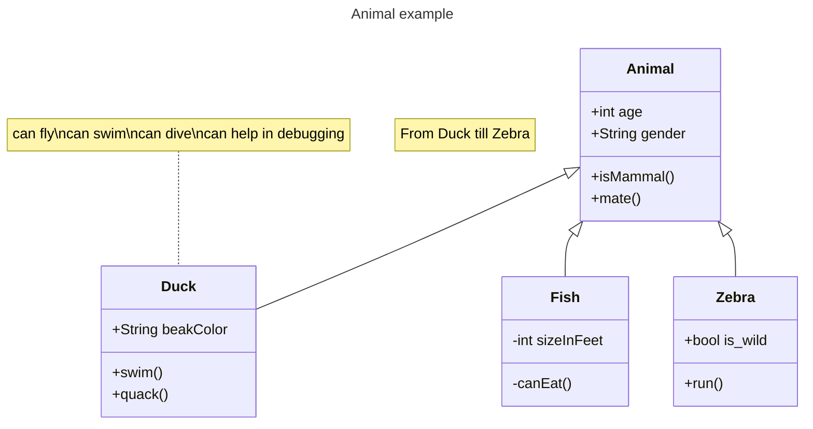

# Профессиональный рост:

вопросы по битроикс 
====================
 1. новый механизм маршрутизации [роутинг](birix_file%2Fbitrix_routing.md) в Битриксе?
 2. [контроллеры](birix_file%2Fbitrix_controllers.md) в Битриксе?

Биг дата  architect
====================
 1. [big_data.md](big_data%2Fbig_data.md)
 2. [EDWH](https://digital.tn.ru/articles/sistemy-khraneniya-i-obrabotki-bolshikh-dannykh/)

Лайфхаки
====================
 1. [lifehacks.md](lifehacks%2Flifehacks.md)

#### Стать экспертом

- Сбор данных
- Анализ данных
- Хранение данных
- Организация данных
- Многопоточная обработка данных

- архитектуры баз данных (данных)
- архитектуры приложений в разрезе баз данных

test diagrams

