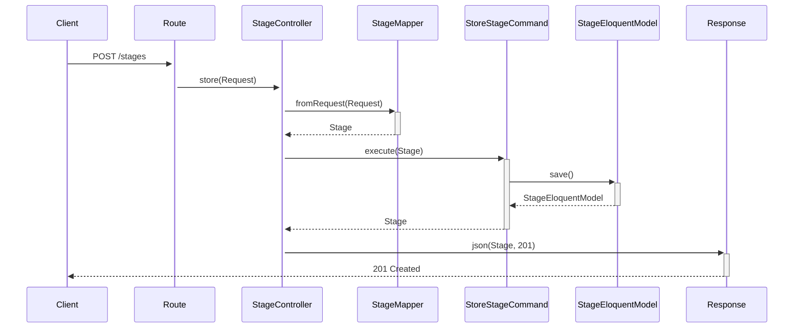
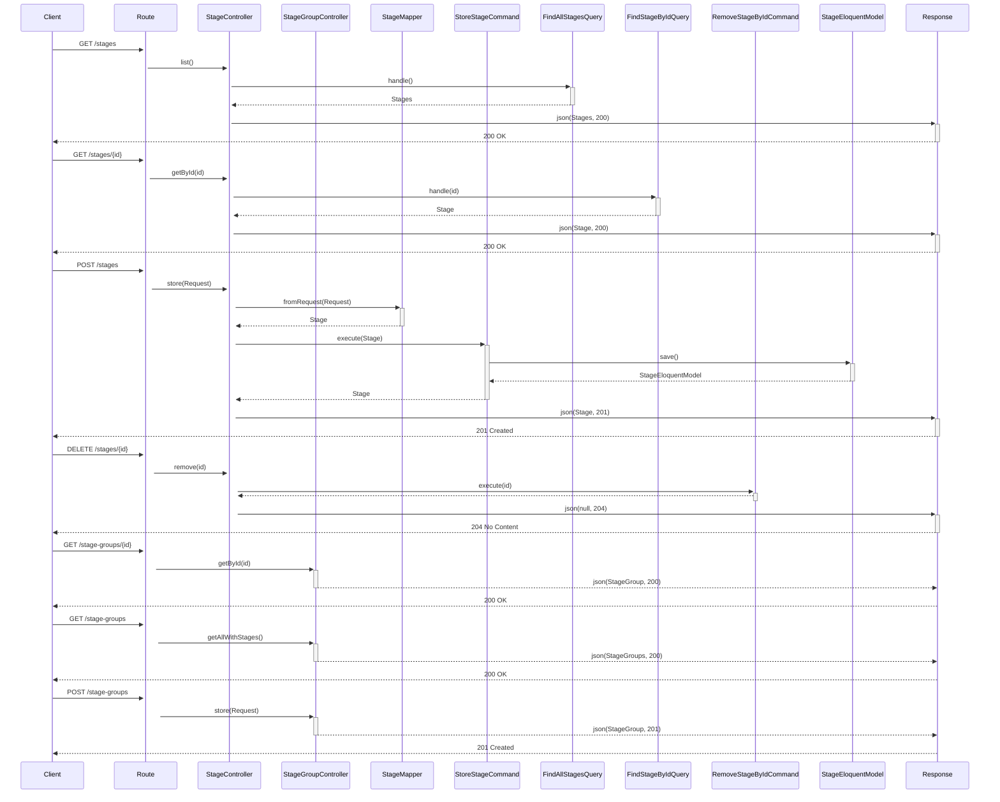

Эта архитектура известна под несколькими названиями:

# Чистая архитектура (Clean Architecture)

## Другие названия этой же архитектуры:

1. **Гексагональная архитектура** (Hexagonal Architecture)
    - Также известна как "Архитектура портов и адаптеров"

2. **Луковая архитектура** (Onion Architecture)
    - Акцентирует внимание на слоях, как в луковице

3. **DDD-архитектура** (Domain-Driven Design)
    - Принципы очень похожи


## Основные принципы:

1. Независимость от фреймворков
2. Тестируемость
3. Независимость от UI
4. Независимость от базы данных
5. Независимость от внешних сервисов

## Ключевые слои (изнутри наружу):
1. `Domain` (Ядро) - самый внутренний слой
2. `Application` (Прикладной слой)
3. `Infrastructure` (Инфраструктурный слой)
4. `UI` (Интерфейсный слой) - самый внешний слой

## Правило зависимостей:
- Зависимости всегда направлены внутрь
- Внутренние слои не знают о существовании внешних
- Внешние слои зависят от внутренних


# Детальная структура слоев

## 1. Domain/
```
Domain/
├── Entities/           # Доменные сущности
│   ├── Stage.php
│   └── ValueObjects/   # Объекты-значения
├── Events/            # Доменные события
│   ├── StageCreated.php
│   └── StageUpdated.php
├── Exceptions/        # Доменные исключения
│   └── StageException.php
├── Repositories/      # Интерфейсы репозиториев
│   └── StageRepositoryInterface.php
└── Services/         # Доменные сервисы
    └── StageService.php
```

## 2. Application/
```
Application/
├── Commands/          # Команды и их обработчики
│   ├── CreateStage/
│   │   ├── CreateStageCommand.php
│   │   └── CreateStageHandler.php
│   └── UpdateStage/
├── DTO/             # Объекты передачи данных
│   ├── StageDTO.php
│   └── Requests/
├── Events/           # Обработчики событий приложения
│   └── Handlers/
├── Exceptions/       # Исключения уровня приложения
│   └── StageApplicationException.php
├── Queries/          # Запросы и их обработчики
│   ├── GetStage/
│   │   ├── GetStageQuery.php
│   │   └── GetStageHandler.php
│   └── ListStages/
├── Services/         # Сервисы приложения
│   └── StageApplicationService.php
└── Validators/       # Валидаторы
    └── StageValidator.php
```

## 3. Infrastructure/
```
Infrastructure/
├── Database/         # Работа с базой данных
│   ├── Migrations/
│   ├── Seeders/
│   └── Models/      # Eloquent модели
├── Repositories/    # Реализации репозиториев
│   └── StageRepository.php
├── Services/       # Реализации внешних сервисов
│   ├── Cache/
│   └── Queue/
└── Providers/      # Service Providers
    └── StageServiceProvider.php
```

## 4. Ui/
```
Ui/
├── API/            # API endpoints
│   ├── Controllers/
│   │   └── StageController.php
│   ├── Requests/   # Form Requests
│   │   └── StageRequest.php
│   ├── Resources/  # API Resources
│   │   └── StageResource.php
│   └── Routes/
│       └── api.php
├── Console/        # Консольные команды
│   └── Commands/
├── Http/          # Web интерфейс
│   ├── Controllers/
│   ├── Middleware/
│   └── Views/
└── Responses/     # Форматтеры ответов
    └── ApiResponse.php
```

## Рекомендации по использованию:

### Domain/
- `Entities/`: Содержит основные бизнес-модели
    - Используйте Value Objects для инкапсуляции атрибутов
    - Реализуйте бизнес-правила внутри сущностей
- `Events/`: События, возникающие в домене
    - Именуйте в прошедшем времени (Created, Updated, etc.)
- `Repositories/`: Только интерфейсы, без реализации
    - Определяйте методы для работы с коллекциями сущностей

### Application/
- `Commands/`: Один обработчик для одной команды
    - Используйте DTO для передачи данных
    - Валидируйте входные данные
- `Queries/`: Отделяйте чтение от записи (CQRS)
    - Оптимизируйте запросы для чтения
- `Services/`: Оркестрация бизнес-процессов
    - Не дублируйте логику из доменного слоя

### Infrastructure/
- `Database/`:
    - Отделяйте Eloquent модели от доменных сущностей
    - Используйте фабрики для тестовых данных
- `Repositories/`:
    - Реализуйте маппинг между моделями и сущностями
    - Обрабатывайте исключения базы данных

### Ui/
- `API/`:
    - Используйте Resources для форматирования ответов
    - Валидируйте входные данные через Form Requests
- `Http/`:
    - Разделяйте логику API и web-интерфейса
    - Используйте middleware для общей функциональности

## Правила именования файлов:

1. **Сущности**: `{Name}.php`
2. **Интерфейсы**: `{Name}Interface.php`
3. **Репозитории**: `{Name}Repository.php`
4. **Команды**: `{Action}{Name}Command.php`
5. **Обработчики**: `{Action}{Name}Handler.php`
6. **DTO**: `{Name}DTO.php`
7. **Контроллеры**: `{Name}Controller.php`

### Именование доп правила
```
Сущности: существительные (Stage, User)
Сервисы: существительные (StageService)
Команды: глаголы (CreateStage, UpdateStage)
События: прошедшее время (StageCreated, StageUpdated)
```


Эта структура обеспечивает:
- Чёткую организацию кода
- Легкий поиск нужных файлов
- Масштабируемость проекта
- Удобство поддержки
- Соответствие принципам SOLID


# Дополнительные рекомендации для эффективной организации проекта

## 1. Автоматизация процессов

### Настройка IDE
```php
// PHPStorm Live Templates для быстрого создания классов:
// command -> Создание Command класса
// handler -> Создание Handler класса
// dto -> Создание DTO класса
```

### Скрипты для генерации кода
```bash
# Создание артефактов через консольные команды
php artisan make:domain-entity Stage
php artisan make:application-dto StageDTO
php artisan make:ui-controller StageController
```

## 2. Документация проекта

### README.md в корне проекта
```markdown
# Stage Module
- Описание модуля
- Инструкция по установке
- Основные команды
- Примеры использования
```

### Документация в коде
```php
/**
 * @group Stage Management
 * @description Управление этапами проекта
 */
class StageController
{
    // ...
}
```

## 3. Организация рабочего процесса

### Git Flow
```
main    -> Продакшен версия
develop -> Основная ветка разработки
feature -> Новый функционал
hotfix  -> Срочные исправления
release -> Подготовка релиза
```

### Структура коммитов
```
feat(stage): добавить создание этапа
fix(stage): исправить валидацию дат
docs(stage): обновить документацию API
```

## 4. Стандарты кода

### PHP CS Fixer
```json
{
    "rules": {
        "@PSR2": true,
        "array_syntax": {"syntax": "short"},
        "ordered_imports": true
    }
}
```

### PHPStan
```yaml
parameters:
  level: 8
  paths:
    - app/Stage
```

## 5. Организация тестов

### Структура тестов
```
tests/
├── Unit/
│   └── Stage/
│       ├── Domain/
│       ├── Application/
│       └── Infrastructure/
└── Feature/
    └── Stage/
        └── Ui/
```

### Тестовые данные
```php
// database/factories/
class StageFactory extends Factory
{
    protected $model = Stage::class;
    
    public function definition()
    {
        return [
            // ...
        ];
    }
}
```

## 6. Мониторинг и логирование

### Структура логов
```php
Log::channel('stage')->info('Stage created', [
    'stage_id' => $stage->id,
    'created_by' => $user->id,
    'context' => $additionalData
]);
```

### Метрики
```php
// Prometheus/Grafana метрики
$counter->inc(['stage_type' => 'created']);
```

## 7. Среда разработки

### Docker-compose
```yaml
services:
  app:
    build: .
    volumes:
      - ./:/var/www
  mysql:
    image: mysql:8.0
  redis:
    image: redis:alpine
```

### Makefile
```makefile
install:
    composer install
    php artisan migrate
    
test:
    php artisan test --testsuite=Stage

lint:
    ./vendor/bin/php-cs-fixer fix
```

## 8. Code Review чеклист

### Перед отправкой PR
```
✓ Тесты написаны и проходят
✓ Код отформатирован
✓ PHPStan не выдает ошибок
✓ Документация обновлена
✓ Логирование добавлено
```

## 9. Оптимизация производительности

### Кэширование
```php
// Infrastructure/Cache/StageCache.php
public function remember(string $key, callable $callback)
{
    return Cache::tags(['stage'])->remember($key, 3600, $callback);
}
```

### Очереди
```php
// Application/Jobs/ProcessStageJob.php
class ProcessStageJob implements ShouldQueue
{
    public function handle()
    {
        // Асинхронная обработка
    }
}
```

## 10. Безопасность

### Валидация входных данных
```php
// Application/Validators/StageValidator.php
public function rules(): array
{
    return [
        'name' => 'required|string|max:255',
        'start_date' => 'required|date',
        'end_date' => 'required|date|after:start_date'
    ];
}
```

### Авторизация
```php
// Domain/Policies/StagePolicy.php
public function update(User $user, Stage $stage): bool
{
    return $user->hasPermission('stage.update');
}
```

## 11. Рекомендации по работе с кодом

### IDE Helpers
```bash
# Генерация подсказок для IDE
php artisan ide-helper:generate
php artisan ide-helper:models
php artisan ide-helper:meta
```

### Именование
```
Сущности: существительные (Stage, User)
Сервисы: существительные (StageService)
Команды: глаголы (CreateStage, UpdateStage)
События: прошедшее время (StageCreated, StageUpdated)
```

Эти рекомендации помогут:
- Ускорить разработку
- Улучшить качество кода
- Упростить поддержку
- Облегчить командную работу
- Сделать проект более надежным
- Обеспечить масштабируемость





