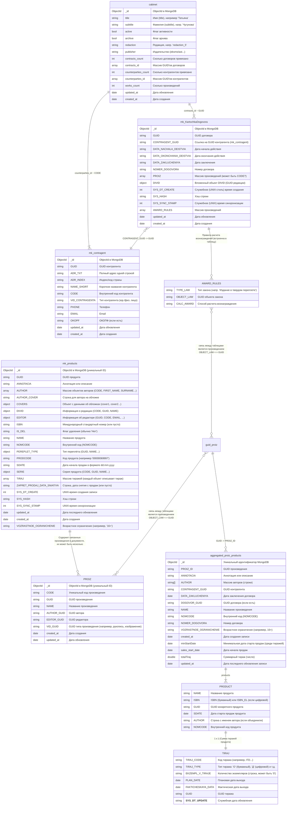

```mermaid
---
config:
  theme: default
---
erDiagram
    aggregated_proiz_products {
        ObjectId _id "Уникальный идентификатор MongoDB"
        string PROIZ_ID "GUID произведения"
        string ANNOTACIA "Аннотация или описание"
        string[] AUTHOR "Массив авторов (строки)"
        string CONTRAGENT_GUID "GUID контрагента"
        date DATA_ZAKLUCHENIYA "Дата заключения договора"
        string DOGOVOR_GUID "GUID договора (если есть)"
        string NAME "Название произведения"
        string NOMCODE "Внутренний код (NOMCODE)"
        string NOMER_DOGOVORA "Номер договора"
        string VOZRASTNOE_OGRANICHENIE "Возрастное ограничение (например, 16+)"
        date created_at "Дата создания записи"
        date minStartDate "Минимальная дата старта продаж (среди тиражей)"
        date sales_start_date "Дата начала продаж"
        double totalTiraj "Суммарный тираж (число)"
        date updated_at "Дата последнего обновления записи"
    }
    PRODUCT {
        string NAME "Название продукта"
        string ISBN "ISBN (бумажный) или ISBN_EL (если цифровой)"
        string GUID "GUID конкретного продукта"
        date SDATE "Дата старта продаж продукта"
        string AUTHOR "Строка с именем автора (если объединили)"
        string NOMCODE "Внутренний код продукта"
    }
    TIRAJ {
        string TIRAJ_CODE "Код тиража (например, ITD...)"
        string TIRAJ_TYPE "Тип тиража: 'О' (бумажный), 'Д' (цифровой) и т.д."
        string EKZEMPL_V_TIRAJE "Количество экземпляров (строка, может быть '0')"
        date PLAN_DATE "Плановая дата выхода"
        date FAKTICHESKAYA_DATA "Фактическая дата выхода"
        string GUID "GUID тиража"
        string __SYS_DT_UPDATE__ "Служебная дата обновления"
    }

%% ==========================================
%% mk_KartochkaDogovora (документы-договоры)
%% ==========================================
    mk_KartochkaDogovora {
        ObjectId _id "ObjectId в MongoDB"
        string GUID "GUID договора"
        string CONTRAGENT_GUID "Ссылка на GUID контрагента (mk_contragent)"
        string DATA_NACHALA_DEISTVIA "Дата начала действия"
        string DATA_OKONCHANIA_DEISTVIA "Дата окончания действия"
        string DATA_ZAKLUCHENIYA "Дата заключения"
        string NOMER_DOGOVORA "Номер договора"
        array PROIZ "Массив произведений (может быть CODE?)"
        object DIVID "Вложенный объект DIVID (GUID редакции)"
        int SYS_DT_CREATE "Служебное (UNIX-стиль) время создания"
        string SYS_HASH "Хэш строки"
        int SYS_SYNC_STAMP "Служебное (UNIX) время синхронизации"
        array AWARD_RULES "Массив произведений"
        date updated_at "Дата обновления"
        date created_at "Дата создания"
    }

    AWARD_RULES {
        string TYPE_LAW "Тип закона (напр. 'Издание в твердом переплете')"
        string OBJECT_LAW "GUID объекта закона"
        string CALC_AWARD "Способ расчета вознаграждения"
    }

%% ==========================================
%% mk_products (продукция — бумажная/цифровая)
%% ==========================================
    mk_products {
        ObjectId _id "ObjectId в MongoDB (уникальный ID)"
        string GUID "GUID продукта"
        string ANNOTACIA "Аннотация или описание"
        array AUTHOR "Массив объектов авторов (CODE, FIRST_NAME, SURNAME...)"
        string AUTHOR_COVER "Строка для автора на обложке"
        object COVERS "Объект с данными об обложках (cover1, cover2...)"
        object DIVID "Информация о редакции (CODE, GUID, NAME)"
        object EDITOR "Информация об редакторе (GUID, CODE, EMAIL, ...)"
        string ISBN "Международный стандартный номер (или пусто)"
        string IS_DEL "Флаг удаления (обычно 'Нет')"
        string NAME "Название продукта"
        string NOMCODE "Внутренний код (NOMCODE)"
        object PEREPLET_TYPE "Тип переплёта (GUID, NAME...)"
        string PRODCODE "Код продукта (например '00000069997')"
        string SDATE "Дата начала продаж в формате dd.mm.yyyy"
        object SERIE "Серия продукта (CODE, GUID, NAME...)"
        array TIRAJ "Массив тиражей (каждый объект описывает тираж)"
        string ZAPRET_PRODAJ_DATA_SNIATIYA "Строка, дата снятия с продаж (или пусто)"
        int SYS_DT_CREATE "UNIX-время создания записи"
        string SYS_HASH "Хэш строки"
        int SYS_SYNC_STAMP "UNIX-время синхронизации"
        date updated_at "Дата последнего обновления"
        date created_at "Дата создания"
        string VOZRASTNOE_OGRANICHENIE "Возрастное ограничение (например, '16+')"
    }

    PROIZ {
        ObjectId _id "ObjectId в MongoDB (уникальный ID)"
        string CODE "Уникальный код произведения"
        string GUID "GUID произведения"
        string NAME "Название произведения"
        string AUTHOR_GUID "GUID автора"
        string EDITOR_GUID "GUID редактора"
        string VID_GUID "GUID типа произведения (например, рукопись, изображение)"
        date created_at "Дата создания"
        date updated_at "Дата обновления"
    }

%% ==========================================
%% mk_contragent (контрагенты — юр./физ. лица)
%% ==========================================
    mk_contragent {
        ObjectId _id "ObjectId в MongoDB"
        string GUID "GUID контрагента"
        string ADR_TXT "Полный адрес одной строкой"
        string ADR_INDEX "Индекс/код страны"
        string NAME_SHORT "Короткое название контрагента"
        string CODE "Внутренний код контрагента"
        string VID_CONTRAGENTA "Тип контрагента (юр./физ. лицо)"
        string PHONE "Телефон"
        string EMAIL "Email"
        string OKOPF "ОКОПФ (если есть)"
        date updated_at "Дата обновления"
        date created_at "Дата создания"
    }

%% ==========================================
%% cabinet (некий кабинет/профиль)
%% ==========================================
    cabinet {
        ObjectId _id "ObjectId в MongoDB"
        string title "Имя (title), например 'Татьяна'"
        string subtitle "Фамилия (subtitle), напр. 'Чугунова'"
        bool active "Флаг активности"
        bool archive "Флаг архива"
        string redaction "Редакция, напр. 'redaction_5'"
        string publisher "Издательство (eksmo/ast...)"
        int contracts_count "Сколько договоров привязано"
        array contracts_id "Массив GUID'ов договоров"
        int counterparties_count "Сколько контрагентов привязано"
        array counterparties_id "Массив GUID'ов контрагентов"
        int works_count "Сколько произведений"
        date updated_at "Дата обновления"
        date created_at "Дата создания"
    }


%% ==========================================
%% СВЯЗИ МЕЖДУ СУЩНОСТЯМИ
%% ==========================================


    aggregated_proiz_products ||--|{ PRODUCT : "products"
    PRODUCT ||--|| TIRAJ : "1 к 1 (Сумма тиражей продукта)"
    mk_products ||--o{ PROIZ : "Содержит связанные произведения в докумменте, их может быть несколько"
    guid_proiz ||--o{ aggregated_proiz_products : "GUID -> PROIZ_ID"

%% Связь между Contracts и AWARD_RULES
    mk_KartochkaDogovora ||--o{ AWARD_RULES : "Правила расчета вознаграждений (встроенна в таблицу)"
    AWARD_RULES }o--o{ guid_proiz : "связь между таблицами является произведением OBJECT_LAW <-> GUID"
    guid_proiz }o--o{ PROIZ : "связь между таблицами является произведением OBJECT_LAW <-> GUID"

%% 1) mk_KartochkaDogovora ссылается на mk_contragent по CONTRAGENT_GUID
    mk_KartochkaDogovora }o--|| mk_contragent : "CONTRAGENT_GUID -> GUID"

%% 2) cabinet: контрагенты в массиве counterparties_id, 
%%    а договоры в contracts_id (т. е. GUID'ы mk_contragent и mk_KartochkaDogovora)
%%    Формально это «многие ко многим» через массивы GUID'ов
    cabinet ||--|{ mk_KartochkaDogovora : "contracts_id ~ GUID"
    cabinet ||--|{ mk_contragent : "counterparties_id ~ CODE"

%% 3) mk_products часто не напрямую связана с mk_KartochkaDogovora,
%%    но может ссылаться на те же произведения (GUID), 
%%    здесь связь условная, если нужно:
%% mk_KartochkaDogovora }o--o{ mk_products : "PROIZ[].GUID <-> AWARD_RULES.OBJECT_LAW"


```